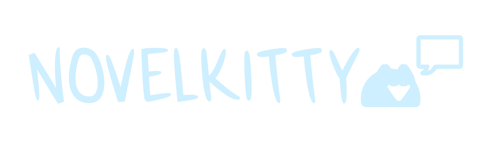

Visual novel framework written in C that compiles to WASM for lightweight 2D games.

## Installation

1. NovelKitty relies on Emscripten, SDL2, and SDL2 Image. Install emscripten using [this guide](https://emscripten.org/docs/getting_started/downloads.html). Then install SDL2 and SDL2 Image with the commands listed below.

> [!IMPORTANT]  
> Don't install emscripten with `brew`/`apt` as you might encounter errors.

**Mac:**

```
brew install sdl2
brew install sdl2_image
```

**Debian/Ubuntu:**

```
sudo apt update
sudo apt install libsdl2-dev
sudo apt install libsdl2-image-dev
```

2. Clone NovelKitty.

```
git clone https://github.com/dairycultist/NovelKitty
cd NovelKitty
```

3. Build and launch the demo game.

```
make run
```

`nk/` contains all the NovelKitty source files. `assets/` contains all the images of your game (they MUST be in this folder, unless you choose to modify the Makefile). `demo.c` is a demo game that demonstrates the functionality of NovelKitty — a good place to start!

## Uploading to Itch.io

After building, go into the `build` folder and zip `index.html`, `index.js`, and `index.wasm` together. This zip is what you will upload to Itch.io. Remember to check `This file will be played in the browser` on the uploaded file.

*Optional but recommended:* On the Itch.io edit page, under `Embed options > Viewport dimensions`, set the width/height to 512x384.

## Copyright

NovelKitty is licensed under Apache License, Version 2.0. **The only files that fall under this license are** `nk/novel_kitty.c` `nk/novel_kitty.h` **and** `logo.png`**.** All other files are CC0.
